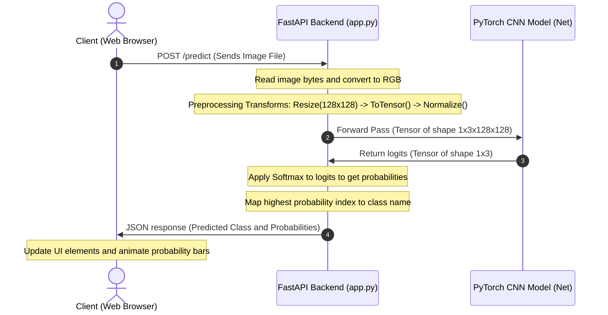
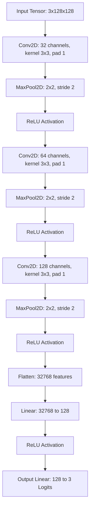

# Animal Face Classification: Model and Web Application

This repository contains a PyTorch deep learning project and an accompanying FastAPI web application designed to classify animal faces into three distinct categories: Cat, Dog, and Wild Animal.

---

## Application Workflow Diagram

The sequence diagram below represents the exact flow of data from the web interface, through the FastAPI backend server, and into the PyTorch CNN model for inference:



---

## Model Architecture Diagram

The flowchart below represents the structure of the custom Convolutional Neural Network (CNN) defined in the project:



---

## Project Overview

The project uses the Animal Faces High Quality (AFHQ) dataset containing animal faces categorized into:
*   Cat
*   Dog
*   Wild (e.g., foxes, lions, tigers, leopards)

The training pipeline runs for 10 epochs using the Adam optimizer (learning rate 1e-4) and CrossEntropyLoss, achieving high performance on the test set.

*   **Test Dataset Accuracy**: 97.56%
*   **Test Loss**: 0.011
*   **Training Split**: 70% Train (11,291 images), 15% Validation (2,419 images), 15% Test (2,420 images)

---

## Web Application Design

The web application provides a professional interface configured to match a clean and professional dark color palette. It features:
*   **Dashboard metrics**: Displaying accuracy, loss, training epochs, and target classes.
*   **Minimalist palette**: Using solid dark slate backgrounds, solid gray borders, and no gradient color schemes.
*   **Inference Dashboard**: Featuring a drag-and-drop file upload zone, live image preview, and prediction class outputs with bar graphs. Emojis are excluded in favor of clean text labels.
*   **Model Card Section**: Outlining network parameters and layers.

---

## Installation and Execution

1.  **Install dependencies**:
    ```bash
    pip install -r requirements.txt
    ```
2.  **Start the web server**:
    ```bash
    python -m uvicorn app:app --reload --host 127.0.0.1 --port 8000
    ```
3.  **Access the Dashboard**: Open your web browser and navigate to `http://127.0.0.1:8000/`.
